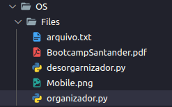
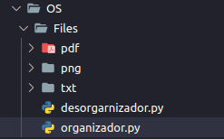

<h1 align="center"> Organizando e Desorganizando Arquivos com Python </h1>

#Projeto desenvolvido no Módulo de Python Start da Trilha de Trading Quantitativo da Asimov Academy.  

  <a href="#-tecnologias">Tecnologias</a>&nbsp;&nbsp;&nbsp;

 

O Script organizador.py cria e coloca em pasta os arquivos de acordo com o seu tipo! 

 ANTES  

  

 DEPOIS  

  

 Só não coloca arquivos .py  

## 🚀 Tecnologias

Esse projeto foi desenvolvido com as seguintes tecnologias:

- Python
- Git e Github

